.. header:: `Home </>`_ > `Matplotlib by Example </matplotlib/>`_ > `Shapes </matplotlib/shapes/>`_ > `Arrow </matplotlib/shapes/arrow/>`_

Matplotlib by Example
~~~~~~~~~~~~~~~~~~~~~

Arrow
=====

.. contents::
    :depth: 2
    :backlinks: top

.. sectnum::

Hello Arrow
------------

.. include:: arrow.py
    :code: python
    :start-after: # -(1)
    :end-before: # -(/1)

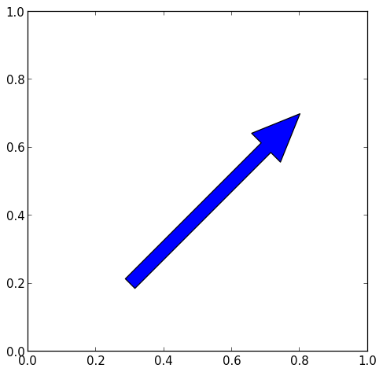

Remove Background
-----------------

.. include:: arrow.py
    :code: python
    :start-after: # -(2)
    :end-before: # -(/2)

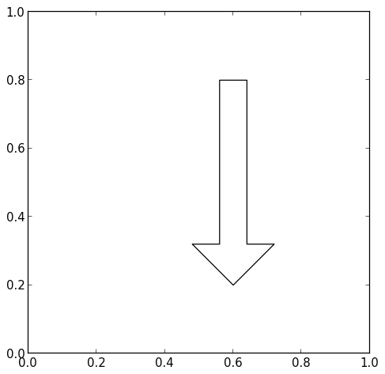

Background Patterns
-------------------

.. include:: arrow.py
    :code: python
    :start-after: # -(3)
    :end-before: # -(/3)

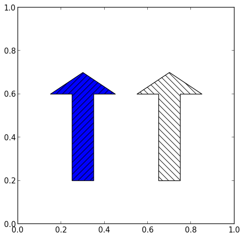

.. include:: arrow.py
    :code: python
    :start-after: # -(4)
    :end-before: # -(/4)

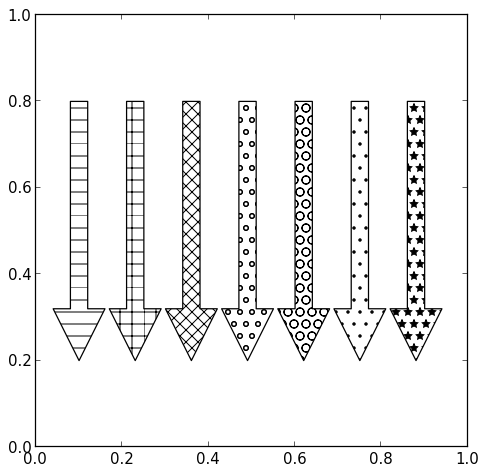

Background Alpha
----------------

.. include:: arrow.py
    :code: python
    :start-after: # -(5)
    :end-before: # -(/5)

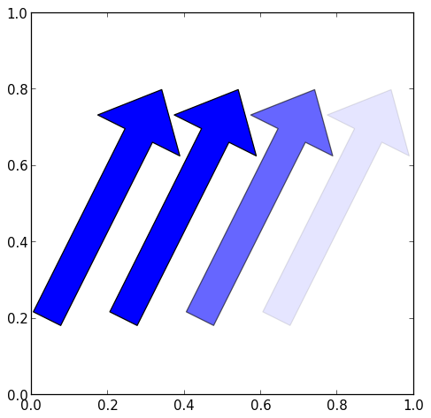

Background Color
----------------

.. include:: arrow.py
    :code: python
    :start-after: # -(6)
    :end-before: # -(/6)

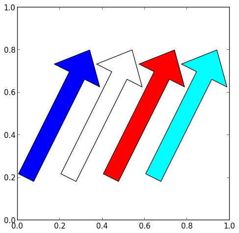

Border Color
------------

.. include:: arrow.py
    :code: python
    :start-after: # -(7)
    :end-before: # -(/7)

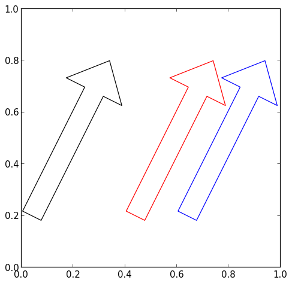

Border Width
------------

.. include:: arrow.py
    :code: python
    :start-after: # -(8)
    :end-before: # -(/8)

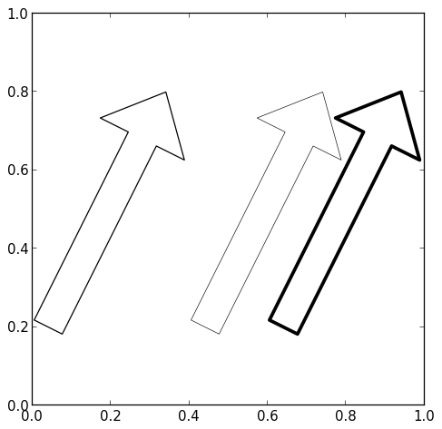

Border Style
------------

.. include:: arrow.py
    :code: python
    :start-after: # -(9)
    :end-before: # -(/9)

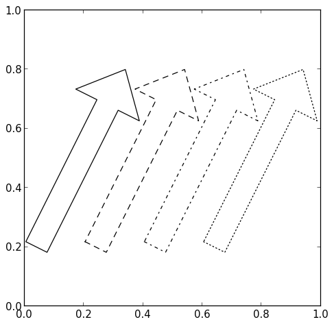

Head Dimensions
---------------

.. note:: 
    This example uses ``FancyArrow`` instead of ``Arrow``.

.. include:: arrow.py
    :code: python
    :start-after: # -(10)
    :end-before: # -(/10)

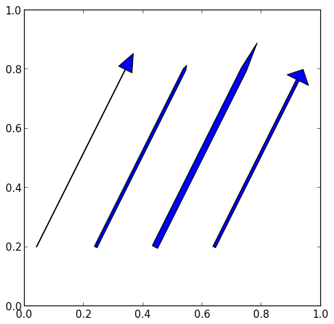

Head Style
----------

.. note:: 
    This example uses ``FancyArrowPatch`` instead of ``Arrow``.

.. include:: arrow.py
    :code: python
    :start-after: # -(11)
    :end-before: # -(/11)

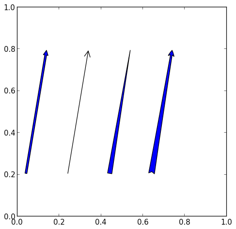

.. include:: arrow.py
    :code: python
    :start-after: # -(12)
    :end-before: # -(/12)

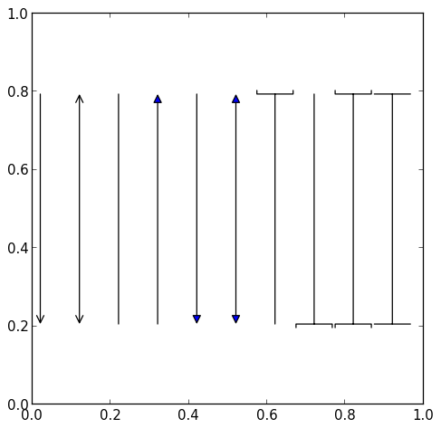

Curved Arrow
------------

.. note:: 
    This example uses ``FancyArrowPatch`` instead of ``Arrow``.

.. include:: arrow.py
    :code: python
    :start-after: # -(13)
    :end-before: # -(/13)

.. figure:: arrow13.png

.. footer:: Copyright 2014 `Matthias Eisen </>`__
