.. header:: `Home </>`_ > `Matplotlib by Example </matplotlib/>`_ > `Shapes </matplotlib/shapes/>`_ > `Regular Polygon </matplotlib/shapes/reg-polygon/>`_

Matplotlib by Example
~~~~~~~~~~~~~~~~~~~~~

Regular Polygon
===============

.. contents::
    :depth: 2
    :backlinks: top

.. sectnum::

Triangle
--------

.. include:: reg-polygon.py
    :code: python
    :start-after: # -(1a)
    :end-before: # -(/1a)

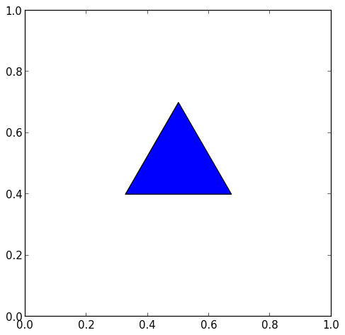

Square
------

.. include:: reg-polygon.py
    :code: python
    :start-after: # -(1b)
    :end-before: # -(/1b)

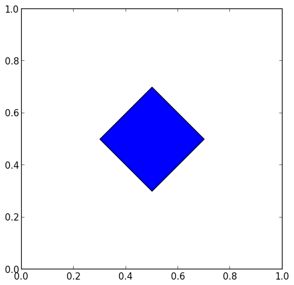

Pentagon
--------

.. include:: reg-polygon.py
    :code: python
    :start-after: # -(1c)
    :end-before: # -(/1c)

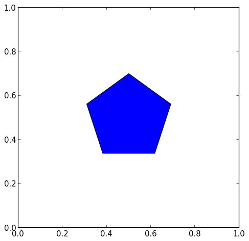

Hexagon
-------

.. include:: reg-polygon.py
    :code: python
    :start-after: # -(1d)
    :end-before: # -(/1d)

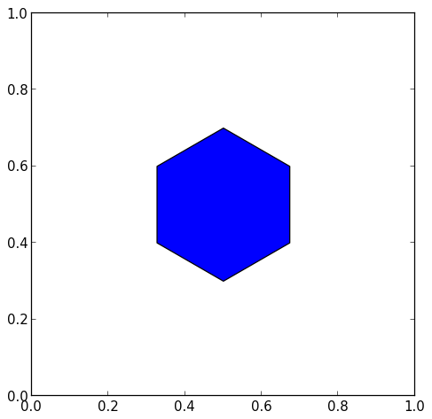

Remove Background
-----------------

.. include:: reg-polygon.py
    :code: python
    :start-after: # -(2)
    :end-before: # -(/2)

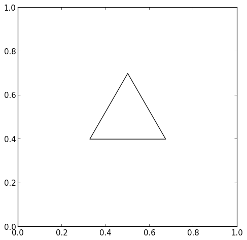

Background Patterns
-------------------

.. include:: reg-polygon.py
    :code: python
    :start-after: # -(3)
    :end-before: # -(/3)

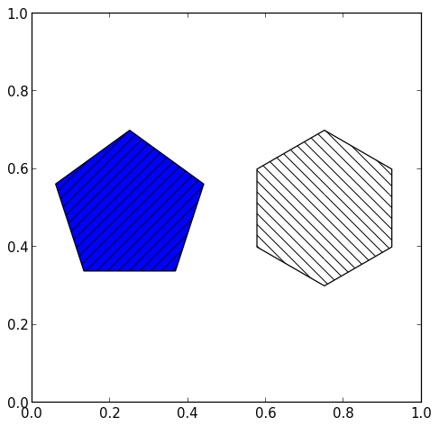

.. include:: reg-polygon.py
    :code: python
    :start-after: # -(4)
    :end-before: # -(/4)

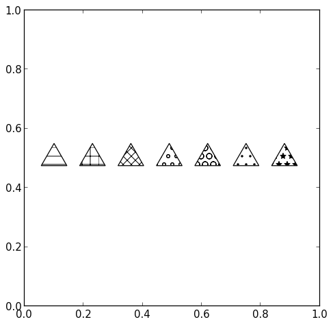

Background Alpha
----------------

.. include:: reg-polygon.py
    :code: python
    :start-after: # -(5)
    :end-before: # -(/5)

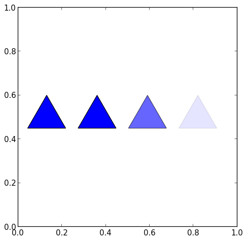

Background Color
----------------

.. include:: reg-polygon.py
    :code: python
    :start-after: # -(6)
    :end-before: # -(/6)

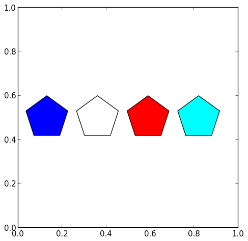

Border Color
------------

.. include:: reg-polygon.py
    :code: python
    :start-after: # -(7)
    :end-before: # -(/7)

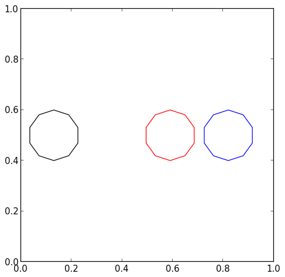

Border Width
------------

.. include:: reg-polygon.py
    :code: python
    :start-after: # -(8)
    :end-before: # -(/8)

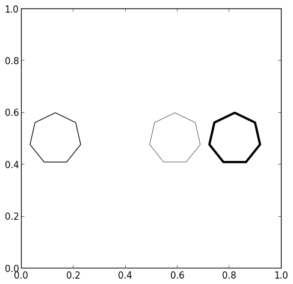

Border Style
------------

.. include:: reg-polygon.py
    :code: python
    :start-after: # -(9)
    :end-before: # -(/9)

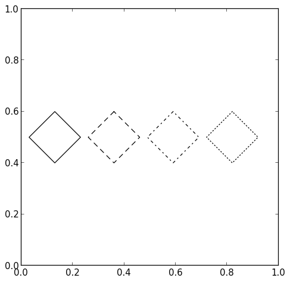

Rotation
--------

.. include:: reg-polygon.py
    :code: python
    :start-after: # -(10)
    :end-before: # -(/10)

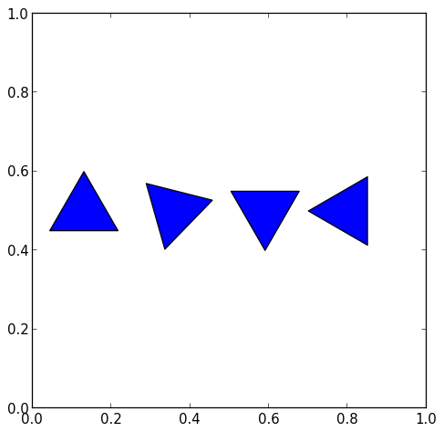

.. footer:: Copyright 2014 `Matthias Eisen </>`__
