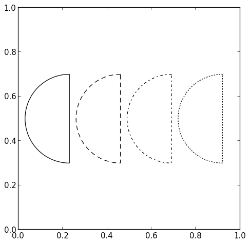

.. header:: `Home </>`_ > `Matplotlib by Example </matplotlib/>`_ > `Shapes </matplotlib/shapes/>`_ > `Wedge </matplotlib/shapes/wedge/>`_

Matplotlib by Example
~~~~~~~~~~~~~~~~~~~~~

Wedge
=====

.. contents::
    :depth: 2
    :backlinks: top

.. sectnum::

Hello Wedge
-----------

.. include:: wedge.py
    :code: python
    :start-after: # -(1)
    :end-before: # -(/1)

.. figure:: wedge1.png

Remove Background
-----------------

.. include:: wedge.py
    :code: python
    :start-after: # -(2)
    :end-before: # -(/2)

Background Patterns
-------------------

.. include:: wedge.py
    :code: python
    :start-after: # -(3)
    :end-before: # -(/3)

.. include:: wedge.py
    :code: python
    :start-after: # -(4)
    :end-before: # -(/4)

Background Alpha
----------------

.. include:: wedge.py
    :code: python
    :start-after: # -(5)
    :end-before: # -(/5)

Background Color
----------------

.. include:: wedge.py
    :code: python
    :start-after: # -(6)
    :end-before: # -(/6)

Border Color
------------

.. include:: wedge.py
    :code: python
    :start-after: # -(7)
    :end-before: # -(/7)

Border Width
------------

.. include:: wedge.py
    :code: python
    :start-after: # -(8)
    :end-before: # -(/8)

Border Style
------------

.. include:: wedge.py
    :code: python
    :start-after: # -(9)
    :end-before: # -(/9)

Partial Wedge
-------------

.. include:: wedge.py
    :code: python
    :start-after: # -(10)
    :end-before: # -(/10)

.. footer:: Copyright 2014 `Matthias Eisen </>`__
